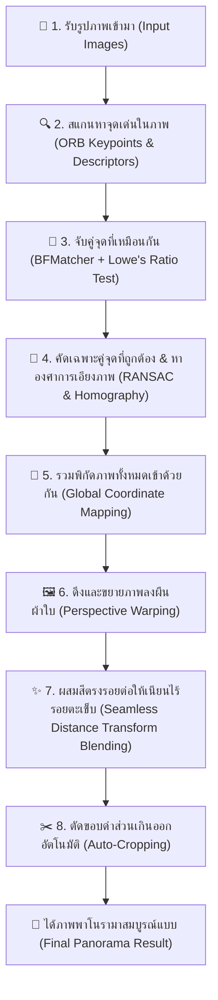

# Automatic Panorama Stitcher 🌐📸
> **Computer Vision Course Project**  
> **Topic:** Automatic Panorama Stitcher: Multi‐image feature matching, Homography warping, and seamless blending  
> **Repository:** [bunyaveedeechuay/Automatic-Panorama-Stitcher](https://github.com/bunyaveedeechuay/Automatic-Panorama-Stitcher)

ระบบต่อภาพพาโนรามาอัตโนมัติที่พัฒนาด้วย **OpenCV.js (WebAssembly)** และ HTML5 Canvas ทำงานบน Web Browser ทั้งหมดแบบ Client-side 100% ไม่ต้องติดตั้งโปรแกรม ไม่ต้องพึ่งพาเซิร์ฟเวอร์ประมวลผล และรูปภาพของผู้ใช้ไม่ถูกส่งออกจากเครื่อง

---

## 🌟 ฟีเจอร์หลัก (Key Features)

1. **Multi-Image Feature Matching**:
   - ตรวจจับจุดสนใจ (Keypoints) และคุณลักษณะ (Descriptors) ด้วย **ORB (Oriented FAST and Rotated BRIEF)**
   - จับคู่จุดเด่นด้วย **Brute-Force Matcher (Hamming Distance)** ร่วมกับ **Lowe's Ratio Test ($0.75$)** เพื่อตัดจุดคลุมเครือออก
   - **Feature Matches Visualizer**: แท็บแสดงภาพจับคู่แบบ Side-by-Side พร้อมวาดเส้นเชื่อมโยงคู่จุด Inliers และ Keypoints แบบโต้ตอบได้
2. **Homography Warping & Unified Coordinate System**:
   - ประมาณค่าเมทริกซ์การแปลงมุมมอง $H_{3\times3}$ ด้วย **RANSAC (Random Sample Consensus)**
   - รองรับการต่อภาพหลายภาพ ($N \ge 2$) โดยแปลงเข้าสู่พิกัดอ้างอิงรวมผ่าน Cumulative Homography Matrix $H_{i \to 0}$
   - คำนวณขอบเขต Bounding Box รวม ($minX, minY, maxX, maxY$) และทำ Perspective Warping ด้วย `cv.warpPerspective`
3. **Seamless Blending (Distance Transform Weighted Feathering)**:
   - ผสมภาพบริเวณรอยต่อด้วย **Euclidean Distance Transform Blending** คำนวณค่าน้ำหนักตามระยะห่างจากขอบ:
     $$w_i(x,y) = \frac{D_i(x,y)}{\sum_k D_k(x,y)}$$
     $$Pixel(x,y) = \sum_k w_i(x,y) \cdot Pixel_i(x,y)$$
   - ไร้รอยต่อคมชัด (No Seam Line), ลดปัญหาแสงและ Vignetting ไม่เท่ากัน
   - มีปุ่มสลับเปรียบเทียบ (Hold-to-Compare) ระหว่าง Seamless Blending กับ Hard Cut ทันที
4. **Auto-Crop Black Borders**:
   - ตรวจจับและตัดขอบดำรอบนอกที่เกิดจากการดึง Perspective ออกให้อัตโนมัติ
5. **Interactive UI & Demo Presets**:
   - ปุ่ม **"โหลดภาพตัวอย่าง (Sample Demo)"** โหลดภาพ `1.jpg`, `2.jpg`, `3.jpg` มาทดสอบได้ในคลิกเดียว
   - ปรับแต่งพารามิเตอร์ ORB Keypoints, RANSAC Inlier Threshold ได้ตามต้องการ

---

## 🚀 การ Deploy ขึ้นเว็บใช้งานจริง (Deployment)

### วิธีที่ 1: GitHub Pages (แนะนำ - ฟรีตลอดชีพ)
เนื่องจากเราได้สร้างไฟล์ GitHub Actions Workflow ไว้ที่ `.github/workflows/deploy.yml` เรียบร้อยแล้ว:
1. Push โค้ดขึ้น GitHub:
   ```bash
   git add .
   git commit -m "Add automatic panorama stitcher with seamless blending and deploy workflow"
   git push origin Kan
   ```
2. ไปที่หน้า GitHub Repository ของคุณ -> เลือกแท็บ **Settings**
3. ที่เมนูด้านซ้าย เลือกหัวข้อ **Pages**
4. ในส่วน **Build and deployment**:
   - เลือก **Source**: `GitHub Actions`
5. GitHub Actions จะทำการ Deploy ให้อัตโนมัติทันที และแสดง URL ประจำเว็บของคุณ เช่น:
   `https://bunyaveedeechuay.github.io/Automatic-Panorama-Stitcher/`

### วิธีที่ 2: Vercel (1-Click Deployment)
1. เข้าไปที่ [Vercel](https://vercel.com/)
2. กด **Add New Project** -> Import GitHub Repository `bunyaveedeechuay/Automatic-Panorama-Stitcher`
3. กด **Deploy** ได้ทันที (มีไฟล์ `vercel.json` รองรับแล้ว)

---

## 💻 วิธีรันบนเครื่อง Local

เนื่องจากเป็น Static Web App สามารถรันผ่าน Local HTTP Server ได้ง่ายๆ:

```bash
# ด้วย Python
python -m http.server 8000

# หรือด้วย Node.js npx
npx serve .
```

แล้วเปิดเว็บเบราว์เซอร์ไปที่ `http://localhost:8000`

---

## 🔬 อธิบายขั้นตอนการทำงานอย่างละเอียด (How It Works — Step by Step)

เพื่อให้เข้าใจง่าย ลองจินตนาการว่าระบบนี้ทำงานเหมือน **"การต่อจิ๊กซอว์รูปถ่ายที่มีส่วนซ้อนทับกัน"** โดยคอมพิวเตอร์จะมองหาจุดที่เหมือนกันในแต่ละภาพ นำมาวางทาบ ดัดมุมมองให้ตรงกัน แล้วเกลี่ยสีตรงรอยต่อให้เนียนสนิท โดยมีขั้นตอนทั้งหมดดังนี้:



---

### ขั้นตอนที่ 1: เตรียมภาพและปรับขนาด (Image Preprocessing)
* **ทำไมต้องทำ?**: ภาพถ่ายจากกล้องมือถือในปัจจุบันมีความละเอียดสูงมาก (เช่น 12MP - 48MP) หากนำมาประมวลผลบนเบราว์เซอร์ทันทีจะทำให้เครื่องค้างหรือหน่วยความจำเต็ม
* **ระบบทำอะไร?**:
  1. ย่อขนาดภาพด้านที่ยาวที่สุดไม่ให้เกิน 1,600 พิกเซล โดยยังคงรักษาสัดส่วนภาพเดิมไว้ เพื่อให้ประมวลผลได้รวดเร็วและลื่นไหล
  2. แปลงภาพเป็นภาพขาวดำ (Grayscale) เพราะการตรวจจับจุดเด่นใช้เพียงระดับความสว่าง (Intensity) ไม่จำเป็นต้องใช้ข้อมูลสีในขั้นตอนนี้

---

### ขั้นตอนที่ 2: ค้นหาจุดเด่นและสร้าง "ลายนิ้วมือ" ของภาพ (ORB Detection & Description)
* **จุดเด่น (Keypoints) คืออะไร?**: คือจุดที่มีเอกลักษณ์ชัดเจนในภาพ เช่น มุมตึก ขอบหน้าต่าง รอยหยักของก้อนหิน หรือลวดลายของป้าย ที่ไม่ว่าจะมองจากมุมไหนก็ยังสังเกตเห็นได้ง่าย
* **ตัวอธิบายจุด (Descriptors) คืออะไร?**: เปรียบเสมือน **"ลายนิ้วมือ"** หรือบัตรประชาชนของจุดนั้นๆ โดยระบบจะมองบริเวณรอบๆ จุดเด่น แล้วแปลงเป็นรหัสตัวเลขฐานสอง (Binary Code) ขนาด 256 บิต
* **ทำไมใช้ ORB?**:
  - ทนต่อการหมุนภาพ (Rotation Invariant) ถ่ายภาพเอียงเล็กน้อยก็ยังจำได้
  - ทนต่อการซูมเข้า-ออก (Scale Invariant) ถ่ายใกล้หรือไกลกว่าเดิมก็ยังจับคู่ได้
  - เร็วกว่าอัลกอริทึมรุ่นเก่าอย่าง SIFT หรือ SURF หลายเท่าตัว และไม่มีข้อจำกัดด้านสิทธิบัตร จึงเหมาะกับการรันบนเว็บเบราว์เซอร์ผ่าน WebAssembly

---

### ขั้นตอนที่ 3: จับคู่จุดเด่นระหว่างภาพที่อยู่ติดกัน (Feature Matching & Ratio Test)
* เมื่อมีภาพที่ 1 และภาพที่ 2 ระบบจะนำ "ลายนิ้วมือ" ของจุดเด่นในภาพที่ 2 ไปเทียบกับทุกจุดในภาพที่ 1 ด้วย **Brute-Force Matcher (Hamming Distance)** เพื่อหาว่าจุดไหนหน้าตาเหมือนกันมากที่สุด
* **คัดกรองจุดหลอกด้วย Lowe's Ratio Test (0.75)**:
  - ในโลกความจริง มักมีลวดลายที่หน้าตาซ้ำๆ กัน (เช่น ตารางหน้าต่าง ลายกระเบื้อง ลายก้อนอิฐ) ซึ่งอาจทำให้คอมพิวเตอร์จับคู่ผิดจุดได้
  - กฎของ Lowe บอกว่า: *"ถ้าจุดที่คล้ายที่สุดอันดับ 1 ใกล้เคียงกับอันดับ 2 มากเกินไป แสดงว่าจุดนี้กำกวมและไม่น่าไว้ใจ ให้ตัดทิ้งทันที"*
  - ระบบจะเก็บเฉพาะคู่จุดที่อันดับ 1 ชนะอันดับ 2 อย่างขาดลอย (ระยะห่างน้อยกว่า 75% ของอันดับ 2) เพื่อให้มั่นใจว่าเป็นจุดเดียวกันจริงๆ

---

### ขั้นตอนที่ 4: คัดกรองคู่จุดที่ผิดพลาด และคำนวณการบิดภาพด้วย RANSAC & Homography
แม้จะผ่านข้อ 3 มาแล้ว ก็อาจยังมีจุดที่จับคู่ผิดหลงเหลืออยู่ (Outliers) เช่น คนเดินผ่าน หรือกิ่งไม้ที่ไหว:

* **RANSAC (Random Sample Consensus) — การโหวตหาเสียงส่วนใหญ่**:
  - เปรียบเหมือนการสุ่มเลือกคู่จุด 4 คู่ขึ้นมาลองคำนวณการวางทาบ แล้วดูว่าคู่จุดคู่อื่นๆ เห็นด้วยกับการทาบนี้กี่จุด
  - ระบบจะสุ่มทำซ้ำหลายๆ รอบ จนเจอแนวทางการทาบภาพที่มีคู่จุดส่วนใหญ่เห็นพ้องต้องกันมากที่สุด (Inliers) แล้วตัดคู่จุดที่ผิดปกติทิ้งไป
* **Homography Matrix ($H_{3\times3}$)**:
  - คือ "เมทริกซ์การแปลงมุมมอง" ขนาด $3\times3$ ตัวเลขในตารางนี้จะบอกคอมพิวเตอร์ว่า **ต้องเลื่อนซ้าย-ขวาเท่าไหร่ หมุนกี่องศา ย่อ-ขยายแค่ไหน และต้องเอียง Perspective อย่างไร** เพื่อให้ภาพที่ 2 นำไปแปะทับลงบนภาพที่ 1 ได้แนบสนิท

---

### ขั้นตอนที่ 5: เชื่อมโยงพิกัดภาพทั้งหมดเข้าด้วยกัน (Global Coordinate Mapping)
* หากต่อภาพมากกว่า 2 ภาพ (เช่น ภาพ 1, 2, 3):
  - ระบบจะกำหนดให้ **ภาพที่ 1 เป็นจุดศูนย์กลางอ้างอิง (Anchor)**
  - ภาพที่ 2 แปลงเข้าหาภาพที่ 1 โดยตรง ($H_{2 \to 1}$)
  - ภาพที่ 3 จะต้องแปลงเข้าหาภาพที่ 2 ก่อน แล้วนำมาคูณต่อเพื่อแปลงเข้าหาภาพที่ 1 อีกที ($H_{3 \to 1} = H_{2 \to 1} \times H_{3 \to 2}$)
* **สร้างผืนผ้าใบขนาดใหญ่ (Global Canvas Bounding Box)**:
  - ระบบจะคำนวณว่าเมื่อกางภาพทั้งหมดออกแล้ว จะกินพื้นที่ กว้าง x สูง เท่าไหร่ และมีมุมไหนหลุดไปติดลบหรือไม่ เพื่อเลื่อนภาพทั้งหมดเข้ามาอยู่ในกรอบผืนผ้าใบเดียวกันอย่างถูกต้อง

---

### ขั้นตอนที่ 6: ดึงมุมมองภาพลงบนผืนผ้าใบ (Perspective Warping)
* นำภาพแต่ละใบมาดึงและบิดมุมมองด้วยฟังก์ชัน `warpPerspective` ของ OpenCV
* ผลลัพธ์ในขั้นตอนนี้คือ ภาพถ่ายทุกใบจะถูกวางเรียงต่อกันบนแคนวาสใหญ่ในมุมมองและระนาบเดียวกันเรียบร้อยแล้ว

---

### ขั้นตอนที่ 7: ผสมสีตรงรอยต่อให้เนียนกริบ (Seamless Distance Transform Blending)
ขั้นตอนนี้คือ **ไฮไลต์สำคัญ** ที่ทำให้ภาพดูเป็นมืออาชีพ:

* **ปัญหาของการต่อแบบตัดแปะธรรมดา (Hard Cut)**:
  - กล้องถ่ายรูปมักมีขอบภาพมืด (Vignetting) หรือความสว่างของแต่ละภาพไม่เท่ากันจากการวัดแสง
  - หากนำมาแปะทับกันตรงๆ จะเห็น **"เส้นรอยต่อคมชัด"** ตัดผ่านท้องฟ้าหรือพื้นหลัง ทำให้ดูหลอกตา
* **วิธีแก้ด้วย Distance Transform Blending**:
  1. ระบบจะวัดระยะทางจากทุกพิกเซลไปยัง "ขอบภาพของตัวเอง" (Euclidean Distance)
  2. **พิกเซลที่อยู่ลึกเข้าไปตรงกลางภาพ** $\rightarrow$ อยู่ไกลขอบภาพ จะได้ค่าน้ำหนักความชัดเจนสูง (100%)
  3. **พิกเซลที่อยู่ใกล้ขอบภาพ** $\rightarrow$ ค่าน้ำหนักจะค่อยๆ ลดลงอย่างนุ่มนวล
  4. บริเวณที่ภาพสองภาพทับซ้อนกัน ระบบจะนำสีของทั้งสองภาพมาเกลี่ยผสมกันตามสัดส่วนน้ำหนัก:
     $$\text{ค่าน้ำหนักของภาพที่ } i = \frac{\text{ระยะห่างจากขอบของภาพ } i}{\text{ผลรวมระยะห่างจากขอบของทุกภาพ}}$$
  5. ผลลัพธ์คือ รอยต่อจะค่อยๆ กลืนเข้าหากันอย่างเป็นธรรมชาติ มองไม่เห็นเส้นรอยต่อเลยแม้แต่น้อย

---

### ขั้นตอนที่ 8: ตัดขอบดำรอบนอกออกให้อัตโนมัติ (Auto-Cropping)
* เนื่องจากการดึงมุมมองภาพ (Perspective Warp) จะทำให้รูปภาพบิดเบี้ยวเป็นรูปสี่เหลี่ยมคางหมู ส่งผลให้เกิดพื้นที่ว่างสีดำรอบๆ ภาพ
* ฟังก์ชัน **Auto-Crop** จะสแกนหาขอบเขตพิกเซลที่มีเนื้อหาจริงจากทั้ง 4 ด้าน (บน, ล่าง, ซ้าย, ขวา) แล้วตัดส่วนที่เป็นขอบดำออก
* ผลลัพธ์สุดท้ายที่ได้คือ **ภาพพาโนรามาสี่เหลี่ยมผืนผ้าที่สมบูรณ์ คมชัด และพร้อมบันทึกนำไปใช้งาน** ทันที!

---

### 📊 สรุปตารางหน้าที่ของแต่ละองค์ประกอบ

| ขั้นตอน | เครื่องมือ / เทคนิค | หน้าที่หลัก | สิ่งที่ได้ออกมา |
| :--- | :--- | :--- | :--- |
| **1. ค้นหาจุดเด่น** | ORB | สแกนหาจุดมุมและลวดลายสำคัญในภาพ | พิกัดจุดเด่น + รหัสลายนิ้วมือ 256-bit |
| **2. จับคู่จุดเด่น** | BFMatcher + Lowe's Ratio (0.75) | จับคู่จุดที่เหมือนกัน และตัดจุดที่สับสนทิ้ง | รายการคู่จุดที่ตรงกัน (Good Matches) |
| **3. กรองจุดหลอก** | RANSAC | กำจัดคู่จุดที่จับคู่ผิดพลาด (Outliers) | คู่จุดที่ถูกต้อง 100% (Inliers) |
| **4. หาการแปลงมุมมอง** | Homography Matrix ($3\times3$) | คำนวณองศา การเลื่อน และการบิดมุมมอง | เมทริกซ์การแปลงภาพ $H$ |
| **5. บิดภาพลงแคนวาส** | `warpPerspective` | วางภาพทุกภาพลงบนผืนผ้าใบเดียวกัน | ภาพที่ถูกดัดมุมมองให้ตรงระนาบ |
| **6. เกลี่ยรอยต่อ** | Distance Transform Blending | ผสมสีตรงรอยต่อตามระยะห่างจากขอบภาพ | ภาพพาโนรามาที่เนียน ไร้รอยต่อคมชัด |
| **7. ตัดขอบ** | Bounding Box Auto-Crop | กำจัดขอบดำจากการดึงมุมมอง | ภาพสี่เหลี่ยมผืนผ้าสวยงามพร้อมใช้งาน |

---

## 🛠 เทคโนโลยีที่ใช้ (Tech Stack)

- **Computer Vision Core**: OpenCV.js 4.9.0 (Emscripten WebAssembly)
- **Frontend Core**: HTML5 Semantic, Canvas API, ECMAScript 2024
- **Styling**: Vanilla CSS3 (Modern Obsidian Design System, Glassmorphism, CSS Custom Properties)
- **Typography**: Plus Jakarta Sans, IBM Plex Sans Thai, IBM Plex Mono
- **Deployment & CI/CD**: GitHub Actions, GitHub Pages, Vercel

---

## 👥 ผู้จัดทำ (Author)

- **วิชา:** Computer Vision
- **GitHub:** [@bunyaveedeechuay](https://github.com/bunyaveedeechuay)
