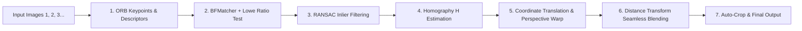

# Automatic Panorama Stitcher 🌐📸
> **Computer Vision Course Project**  
> **Topic:** Automatic Panorama Stitcher: Multi‐image feature matching, Homography warping, and seamless blending  
> **Repository:** [bunyaveedeechuay/Automatic-Panorama-Stitcher](https://github.com/bunyaveedeechuay/Automatic-Panorama-Stitcher)

ระบบต่อภาพพาโนรามาอัตโนมัติที่พัฒนาด้วย **OpenCV.js (WebAssembly)** และ HTML5 Canvas ทำงานบน Web Browser ทั้งหมดแบบ Client-side 100% ไม่ต้องติดตั้งโปรแกรม ไม่ต้องพึ่งพาเซิร์ฟเวอร์ประมวลผล และรูปภาพของผู้ใช้ไม่ถูกส่งออกจากเครื่อง

---

## 🌟 ฟีเจอร์หลัก (Key Features)

1. **Multi-Image Feature Matching**:
   - ตรวจจับจุดสนใจ (Keypoints) และคุณลักษณะ (Descriptors) ด้วย **ORB (Oriented FAST and Rotated BRIEF)**
   - จับคู่จุดเด่นด้วย **Brute-Force Matcher (Hamming Distance)** ร่วมกับ **Lowe's Ratio Test ($0.75$)** เพื่อตัดจุดคลุมเครือออก
   - **Feature Matches Visualizer**: แท็บแสดงภาพจับคู่แบบ Side-by-Side พร้อมวาดเส้นเชื่อมโยงคู่จุด Inliers และ Keypoints แบบโต้ตอบได้
2. **Homography Warping & Unified Coordinate System**:
   - ประมาณค่าเมทริกซ์การแปลงมุมมอง $H_{3\times3}$ ด้วย **RANSAC (Random Sample Consensus)**
   - รองรับการต่อภาพหลายภาพ ($N \ge 2$) โดยแปลงเข้าสู่พิกัดอ้างอิงรวมผ่าน Cumulative Homography Matrix $H_{i \to 0}$
   - คำนวณขอบเขต Bounding Box รวม ($minX, minY, maxX, maxY$) และทำ Perspective Warping ด้วย `cv.warpPerspective`
3. **Seamless Blending (Distance Transform Weighted Feathering)**:
   - ผสมภาพบริเวณรอยต่อด้วย **Euclidean Distance Transform Blending** คำนวณค่าน้ำหนักตามระยะห่างจากขอบ:
     $$w_i(x,y) = \frac{D_i(x,y)}{\sum_k D_k(x,y)}$$
     $$Pixel(x,y) = \sum_k w_i(x,y) \cdot Pixel_i(x,y)$$
   - ไร้รอยต่อคมชัด (No Seam Line), ลดปัญหาแสงและ Vignetting ไม่เท่ากัน
   - มีปุ่มสลับเปรียบเทียบ (Hold-to-Compare) ระหว่าง Seamless Blending กับ Hard Cut ทันที
4. **Auto-Crop Black Borders**:
   - ตรวจจับและตัดขอบดำรอบนอกที่เกิดจากการดึง Perspective ออกให้อัตโนมัติ
5. **Interactive UI & Demo Presets**:
   - ปุ่ม **"โหลดภาพตัวอย่าง (Sample Demo)"** โหลดภาพ `1.jpg`, `2.jpg`, `3.jpg` มาทดสอบได้ในคลิกเดียว
   - ปรับแต่งพารามิเตอร์ ORB Keypoints, RANSAC Inlier Threshold ได้ตามต้องการ
   - แท็บ **Homography Matrix Inspector** แสดงค่าเมทริกซ์ $H_{3\times3}$ และวิเคราะห์ Translation / Scale / Tilt

---

## 🚀 การ Deploy ขึ้นเว็บใช้งานจริง (Deployment)

### วิธีที่ 1: GitHub Pages (แนะนำ - ฟรีตลอดชีพ)
เนื่องจากเราได้สร้างไฟล์ GitHub Actions Workflow ไว้ที่ `.github/workflows/deploy.yml` เรียบร้อยแล้ว:
1. Push โค้ดขึ้น GitHub:
   ```bash
   git add .
   git commit -m "Add automatic panorama stitcher with seamless blending and deploy workflow"
   git push origin Kan
   ```
2. ไปที่หน้า GitHub Repository ของคุณ -> เลือกแท็บ **Settings**
3. ที่เมนูด้านซ้าย เลือกหัวข้อ **Pages**
4. ในส่วน **Build and deployment**:
   - เลือก **Source**: `GitHub Actions`
5. GitHub Actions จะทำการ Deploy ให้อัตโนมัติทันที และแสดง URL ประจำเว็บของคุณ เช่น:
   `https://bunyaveedeechuay.github.io/Automatic-Panorama-Stitcher/`

### วิธีที่ 2: Vercel (1-Click Deployment)
1. เข้าไปที่ [Vercel](https://vercel.com/)
2. กด **Add New Project** -> Import GitHub Repository `bunyaveedeechuay/Automatic-Panorama-Stitcher`
3. กด **Deploy** ได้ทันที (มีไฟล์ `vercel.json` รองรับแล้ว)

---

## 💻 วิธีรันบนเครื่อง Local

เนื่องจากเป็น Static Web App สามารถรันผ่าน Local HTTP Server ได้ง่ายๆ:

```bash
# ด้วย Python
python -m http.server 8000

# หรือด้วย Node.js npx
npx serve .
```

แล้วเปิดเว็บเบราว์เซอร์ไปที่ `http://localhost:8000`

---

## 🔬 ทฤษฎี Computer Vision เบื้องหลังการทำงาน



### 1. ORB (Oriented FAST and Rotated BRIEF)
- **Keypoint Detection**: ใช้ FAST Corner Detector พร้อมการสร้าง Scale Pyramid เพื่อให้ทนทานต่อการเปลี่ยนแปลงสเกล
- **Orientation Assignment**: คำนวณ Intensity Centroid ของ Patch เพื่อกำหนดทิศทางมุม ให้ทนทานต่อการหมุน (Rotation Invariant)
- **Descriptor**: สร้าง Binary String 256-bit จากคู่พิกเซลที่ถูกหมุนตาม Orientation ทำให้คำนวณระยะทางด้วย Hamming Distance ได้อย่างรวดเร็วระดับฮาร์ดแวร์

### 2. Matching & Lowe's Ratio Test
- จับคู่เวกเตอร์ด้วย Brute-Force Matcher แบบ $k=2$ ($k$-Nearest Neighbors)
- กรองจุดที่กำกวมออกด้วยอัตราส่วนระยะทาง:
  $$\frac{\text{dist}(m_0)}{\text{dist}(m_1)} < 0.75$$
  หากจุดอันดับ 1 ใกล้กว่าอันดับ 2 อย่างมีนัยสำคัญ จึงยอมรับว่าเป็นคู่แมตช์ที่ดี (Good Match)

### 3. RANSAC Homography Estimation
- Homography คือการแปลงเชิงฉายระนาบ (Planar Projective Transformation) ขนาด $3\times3$ โดยมี Degree of Freedom เท่ากับ 8:
  $$\begin{bmatrix} x' \\ y' \\ 1 \end{bmatrix} \sim \begin{bmatrix} h_{11} & h_{12} & h_{13} \\ h_{21} & h_{22} & h_{23} \\ h_{31} & h_{32} & h_{33} \end{bmatrix} \begin{bmatrix} x \\ y \\ 1 \end{bmatrix}$$
- RANSAC สุ่มเลือกตัวอย่างขั้นต่ำ 4 คู่จุดซ้ำๆ เพื่อหาโมเดลที่มีจำนวน Inliers สูงสุด และตัด Outliers (คู่จุดที่จับคู่ผิดพลาด) ออกอย่างมีประสิทธิภาพ

### 4. Distance Transform Seamless Blending
- ปัญหาของการตัดแปะตรงๆ (Hard Seam) คือรอยต่อคมชัดจากความต่างของความสว่าง (Vignetting / Exposure Variation)
- ระบบใช้ **Euclidean Distance Transform ($L_2$)** คำนวณระยะห่างของแต่ละพิกเซลไปยังขอบที่ใกล้ที่สุดของ Mask ภาพนั้นๆ
- สร้างค่าน้ำหนักปรับเรียบแบบไม่เชิงเส้นตามระยะทาง ส่งผลให้รอยต่อกลมกลืนเป็นเนื้อเดียวกันอย่างไร้รอยต่อ

---

## 🛠 เทคโนโลยีที่ใช้ (Tech Stack)

- **Computer Vision Core**: OpenCV.js 4.9.0 (Emscripten WebAssembly)
- **Frontend Core**: HTML5 Semantic, Canvas API, ECMAScript 2024
- **Styling**: Vanilla CSS3 (Modern Obsidian Design System, Glassmorphism, CSS Custom Properties)
- **Typography**: Plus Jakarta Sans, IBM Plex Sans Thai, IBM Plex Mono
- **Deployment & CI/CD**: GitHub Actions, GitHub Pages, Vercel

---

## 👥 ผู้จัดทำ (Author)

- **วิชา:** Computer Vision
- **GitHub:** [@bunyaveedeechuay](https://github.com/bunyaveedeechuay)
