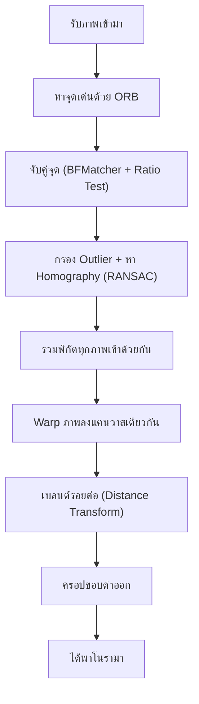

# Automatic Panorama Stitcher

โปรเจกต์ส่งวิชา Computer Vision ครับ หัวข้อที่เลือกทำคือการต่อภาพพาโนรามาแบบอัตโนมัติ — ตั้งแต่หาจุดเด่นในภาพ จับคู่ฟีเจอร์ คำนวณ Homography ไปจนถึงเบลนด์รอยต่อให้เนียน

ทำเป็นเว็บล้วน ๆ ด้วย OpenCV.js (ตัว WebAssembly) กับ Canvas API รันในเบราว์เซอร์ทั้งหมด ไม่มี backend ไม่ต้องอัปโหลดรูปขึ้นเซิร์ฟเวอร์ไหน เปิดหน้าเว็บแล้วลากรูปเข้าไปได้เลย

---

## ทำอะไรได้บ้าง

- **จับคู่ฟีเจอร์หลายภาพ** — ใช้ ORB หาจุดเด่น แล้วจับคู่ด้วย Brute-Force Matcher (Hamming distance) กรองด้วย Lowe's Ratio Test (0.75) ตัดพวกจุดกำกวมทิ้ง มีแท็บให้ดูว่าคอมพิวเตอร์จับคู่จุดไหนกับจุดไหนบ้าง เผื่อใครอยากดูว่าทำไมภาพบางคู่มันต่อไม่ติด
- **Homography + ระบบพิกัดรวม** — ต่อได้ตั้งแต่ 2 ภาพขึ้นไป ใช้ RANSAC หา matrix การแปลงมุมมอง แล้วไล่คูณกันเป็นลูกโซ่ (ภาพที่ 3 ต้องผ่านภาพที่ 2 ก่อนถึงจะไปถึงภาพที่ 1)
- **เบลนด์รอยต่อแบบ Distance Transform** — จุดที่แก้ปัญหาหนักสุดตอนทำ คือรอยต่อภาพมันเห็นชัดมาก (โดยเฉพาะท้องฟ้า) เลยใช้วิธีให้น้ำหนักพิกเซลตามระยะห่างจากขอบภาพ ยิ่งอยู่กลางภาพยิ่งน้ำหนักเยอะ ยิ่งใกล้ขอบยิ่งค่อย ๆ จางลง มีปุ่มกดค้างเทียบกับแบบตัดตรง ๆ (hard cut) ให้เห็นความต่างชัด ๆ
- **ตัดขอบดำอัตโนมัติ** — หลัง warp ภาพจะเหลือขอบดำเป็นสี่เหลี่ยมคางหมู เขียนสคริปต์สแกนหาขอบเนื้อหาจริงแล้วครอปทิ้งให้
- **มีรูปตัวอย่างให้กดลองทันที** ไม่ต้องหารูปเอง

---

## หลักการทำงานคร่าว ๆ

ลองนึกภาพเหมือนต่อจิ๊กซอว์ที่รูปมันซ้อนทับกันบางส่วน คอมพิวเตอร์ต้องหาจุดที่ "หน้าตาเหมือนกัน" ในสองภาพ เอามาวางทาบ ดัดมุมให้ตรงกัน แล้วค่อยเกลี่ยสีตรงรอยต่อทีหลัง

```mermaid
flowchart TD
    A["รับภาพเข้ามา"] --> B["หาจุดเด่นด้วย ORB"]
    B --> C["จับคู่จุด (BFMatcher + Ratio Test)"]
    C --> D["กรอง Outlier + หา Homography (RANSAC)"]
    D --> E["รวมพิกัดทุกภาพเข้าด้วยกัน"]
    E --> F["Warp ภาพลงแคนวาสเดียวกัน"]
    F --> G["เบลนด์รอยต่อ (Distance Transform)"]
    G --> H["ครอปขอบดำออก"]
    H --> I["ได้พาโนรามา"]
```

### 1. ย่อขนาด + แปลงขาวดำ

กล้องมือถือสมัยนี้ถ่ายมาทีนึง 12-48MP ถ้าเอาไซส์เต็มมาประมวลผลในเบราว์เซอร์ เครื่องค้างแน่นอน (ลองมาแล้ว) เลยย่อด้านยาวสุดให้ไม่เกิน 1600px ก่อน แล้วแปลงเป็นขาวดำเพราะขั้นตอนหาจุดเด่นสนใจแค่ความสว่าง ไม่ต้องใช้สี

### 2. หาจุดเด่นด้วย ORB

จุดเด่นคือจุดที่มีลักษณะเฉพาะ เช่น มุมตึก ขอบหน้าต่าง ลายกระเบื้อง — จุดพวกนี้มองจากมุมไหนก็ยังจำได้ พอเจอจุดแล้วระบบจะสร้าง "ลายนิ้วมือ" ของมันเป็นโค้ดไบนารี 256 บิต

เลือก ORB เพราะทนต่อการหมุน/ซูมพอสมควร เร็วกว่า SIFT/SURF เยอะ แล้วก็ไม่ติดเรื่องสิทธิบัตร รันบน WASM ในเบราว์เซอร์ได้สบายกว่า

### 3. จับคู่จุดเด่น + Ratio Test

เทียบลายนิ้วมือของจุดในภาพที่ 2 กับทุกจุดในภาพที่ 1 ด้วย Hamming distance ปัญหาคือบางทีมีลายซ้ำ ๆ กันเยอะ (เช่นตารางหน้าต่าง) ทำให้จับคู่ผิดจุดได้ Lowe's Ratio Test เลยเข้ามาช่วย: ถ้าคู่ที่ดีที่สุดอันดับ 1 กับอันดับ 2 มันใกล้เคียงกันเกินไป แปลว่าจุดนี้กำกวม ตัดทิ้งไปเลยดีกว่า เก็บไว้แต่คู่ที่อันดับ 1 ชนะขาดลอย (ต่ำกว่า 75% ของอันดับ 2)

### 4. RANSAC + Homography

ต่อให้ผ่านข้อ 3 มาแล้วก็ยังมีคู่จุดผิด ๆ หลุดมาได้ (คนเดินผ่าน กิ่งไม้ไหว) RANSAC แก้ปัญหานี้ด้วยการสุ่มจับคู่จุด 4 คู่มาลองคำนวณการทาบภาพ แล้วดูว่าคู่จุดอื่น ๆ เห็นด้วยกี่คู่ ทำซ้ำหลายรอบจนเจอแบบที่มีคนเห็นด้วยเยอะสุด (inliers) ผลลัพธ์ที่ได้คือ Homography matrix ขนาด 3x3 — ตัวเลขในนั้นบอกว่าต้องเลื่อน หมุน ย่อขยาย หรือเอียงมุมมองแค่ไหนภาพถึงจะทาบกันสนิท

### 5. รวมพิกัดทุกภาพ

ถ้าต่อมากกว่า 2 ภาพ ให้ภาพแรกเป็นจุดอ้างอิงหลัก ภาพที่ 2 แปลงเข้าหาภาพที่ 1 ตรง ๆ ส่วนภาพที่ 3 ต้องแปลงเข้าหาภาพที่ 2 ก่อน แล้วเอา matrix มาคูณต่อกันอีกทีถึงจะไปถึงภาพที่ 1 ได้ (H₃→₁ = H₂→₁ × H₃→₂) จากนั้นคำนวณว่าถ้ากางทุกภาพออกจะกินพื้นที่เท่าไหร่ เผื่อพื้นที่ไว้เป็นแคนวาสใหญ่

### 6. Warp ภาพลงแคนวาส

ใช้ `cv.warpPerspective` ของ OpenCV ดึงแต่ละภาพไปวางตามตำแหน่งที่คำนวณไว้

### 7. เบลนด์รอยต่อ — ส่วนที่ปวดหัวที่สุด

ปัญหาของการเอาภาพมาแปะตรง ๆ (hard cut) คือกล้องแต่ละภาพมีขอบมืด (vignette) และความสว่างไม่เท่ากันจากการวัดแสงคนละครั้ง พอแปะทับกันจะเห็นเส้นรอยต่อชัดเจน โดยเฉพาะบนท้องฟ้า

วิธีแก้คือวัดระยะห่างแบบยุคลิดจากทุกพิกเซลไปยังขอบภาพของตัวเอง พิกเซลกลางภาพ (ไกลขอบ) ได้น้ำหนักเยอะ พิกเซลใกล้ขอบน้ำหนักค่อย ๆ ลด บริเวณที่ภาพซ้อนกันก็เอาสีมาผสมกันตามสัดส่วนน้ำหนักนี้:

$$w_i(x,y) = \frac{D_i(x,y)}{\sum_k D_k(x,y)}$$

$$Pixel(x,y) = \sum_k w_i(x,y) \cdot Pixel_i(x,y)$$

ผลคือรอยต่อกลืนกันเนียน ไม่เห็นเส้นแบ่งเลย

### 8. ครอปขอบดำ

Perspective warp ทำให้ภาพกลายเป็นทรงคางหมู เหลือพื้นที่ดำรอบ ๆ เขียนฟังก์ชันสแกนหาขอบเนื้อหาจริงจากทั้ง 4 ด้าน แล้วครอปส่วนดำทิ้ง จบขั้นตอนก็ได้พาโนรามาสี่เหลี่ยมผืนผ้าพร้อมเซฟ

---

## สรุปแต่ละขั้นตอน

| ขั้นตอน | ใช้อะไร | ทำหน้าที่อะไร |
| :--- | :--- | :--- |
| หาจุดเด่น | ORB | สแกนหามุม/ลวดลายเด่นในภาพ |
| จับคู่จุด | BFMatcher + Ratio Test (0.75) | จับคู่จุดที่เหมือนกัน ตัดจุดกำกวมทิ้ง |
| กรอง Outlier | RANSAC | คัดคู่จุดที่จับผิดออก |
| หาการแปลงมุมมอง | Homography (3x3) | คำนวณเลื่อน/หมุน/ย่อขยาย/เอียง |
| Warp ภาพ | `warpPerspective` | วางภาพทุกใบลงแคนวาสเดียวกัน |
| เกลี่ยรอยต่อ | Distance Transform Blending | ผสมสีตรงรอยต่อ |
| ตัดขอบ | Auto-crop bounding box | เอาขอบดำออก |

---

## Tech Stack

- OpenCV.js 4.9.0 (WebAssembly)
- HTML5 / Canvas API / ES2024 ล้วน ๆ ไม่มี framework
- CSS ธรรมดา จัดธีมมืดแบบ glassmorphism นิดหน่อย
- ฟอนต์: Plus Jakarta Sans, IBM Plex Sans Thai, IBM Plex Mono
- Deploy ผ่าน GitHub Pages / Vercel, มี GitHub Actions ไว้ build อัตโนมัติ

---

ถ้าเจอบั๊กหรือมีไอเดียอยากให้เพิ่ม เปิด issue ทิ้งไว้ได้เลยครับ
